# 🚀 kurs24.io Deployment Documentation

## 📋 Deployment Architecture

### System Overview
```
┌─────────────────┐    ┌──────────────────┐    ┌─────────────────┐
│   b6t.de        │    │ kunde1.kurs24.io │    │ kunde2.kurs24.io│
│ Landing/Payment │    │   Tenant App     │    │   Tenant App    │
└─────────────────┘    └──────────────────┘    └─────────────────┘
         │                       │                       │
         └───────────────────────┼───────────────────────┘
                                 │
                        ┌────────▼────────┐
                        │  Caddy Proxy    │
                        │   + Let's       │
                        │   Encrypt SSL   │
                        └─────────────────┘
```

### Directory Structure
```
/home/tba/kurs24-platform/
├── 📁 backend/api/              # Main API Backend
├── 📁 landing/                  # b6t.de Landing Page
├── 📁 master-template/          # MASTER Container Template
├── 📁 tenants/                  # Deployed Customer Instances
│   ├── 📁 neue-akademie/
│   ├── 📁 test-academy/
│   └── 📁 ...weitere-kunden/
├── 📁 infrastructure/
│   └── 📁 caddy/
│       └── 📁 dynamic_subdomains/
│           ├── neue-akademie.caddyfile
│           └── test-academy.caddyfile
├── 📁 scripts/
│   └── 📄 deploy-tenant.sh     # Automated Deployment
└── 📄 docker-compose.yml       # Main Services
```

---

## 🏗️ Deployment Flow

### 1. Customer Journey

```mermaid
sequenceDiagram
    participant K as Kunde
    participant L as b6t.de
    participant P as PayPal
    participant A as API
    participant D as Deploy Script
    participant C as Caddy

    K->>L: Wählt Plan & zahlt
    L->>P: PayPal Checkout
    P->>A: Webhook: Payment confirmed
    A->>D: Trigger: deploy-tenant.sh
    D->>D: Copy MASTER → /tenants/kunde/
    D->>C: Create kunde.caddyfile
    D->>C: Reload Caddy (SSL)
    C->>K: https://kunde.kurs24.io ready! 🎉
```


### 2. Technical Deployment Steps

#### Step 1: Payment Confirmation (Auto)
```bash
# PayPal Webhook triggers API endpoint
POST /api/v1/webhooks/paypal
{
  "event_type": "PAYMENT.SALE.COMPLETED",
  "resource": {
    "custom": "kunde@email.com|neue-akademie|pro"
  }
}
```

#### Step 2: Automatic Tenant Deployment
```bash
# API calls deployment script
./scripts/deploy-tenant.sh neue-akademie pro kunde@email.com ocean-blue
```

#### Step 3: Manual Deployment (if needed)
```bash
# Navigate to platform directory
cd /home/tba/kurs24-platform

# Deploy new tenant
./scripts/deploy-tenant.sh SUBDOMAIN [PLAN] [EMAIL] [COLOR]

# Examples:
./scripts/deploy-tenant.sh test-academy basis admin@test.de classic-royal
./scripts/deploy-tenant.sh firma-schulung pro training@firma.de ocean-blue
./scripts/deploy-tenant.sh ihk-trainer pro trainer@ihk.de forest-green
```

---

## 🔧 Master Template Setup

### Creating the MASTER Template
```bash
# 1. Create master template directory
mkdir -p /home/tba/kurs24-platform/master-template

# 2. Copy your completed tenant app
cp -r /path/to/your/completed-tenant-app/* /home/tba/kurs24-platform/master-template/

# 3. Template structure should be:
master-template/
├── 📄 docker-compose.yml       # Template with variables
├── 📄 .env.template            # Environment template
├── 📄 Dockerfile
├── 📁 src/                     # App source code
├── 📁 public/                  # Static assets
└── 📄 package.json
```

### Template Variables
The deployment script replaces these variables:
- `{{TENANT_ID}}` → Subdomain name
- `{{TENANT_PLAN}}` → basis | pro
- `{{TENANT_EMAIL}}` → Customer email
- `{{TENANT_COLOR}}` → Branding color scheme
- `{{API_PORT}}` → Unique port per tenant
- `{{APP_PORT}}` → Unique app port

---

## 🌐 DNS & SSL Configuration

### Automatic DNS (Porkbun API)
```bash
# DNS is created automatically via Porkbun API in deploy script
# Creates: subdomain.kurs24.io → Server IP

# Required environment variables in .env.production:
PORKBUN_API_KEY=pk1_xxxxx
PORKBUN_SECRET_KEY=sk1_xxxxx
SERVER_IP=152.53.150.111
```

### Caddy SSL Configuration
```caddyfile
# Auto-generated: infrastructure/caddy/dynamic_subdomains/kunde.caddyfile
kunde.kurs24.io {
    # Automatic SSL via Let's Encrypt
    tls {
        issuer acme
    }

    # Reverse proxy to tenant container
    reverse_proxy tenant-kunde-app:3000 {
        header_up X-Real-IP {remote_host}
        header_up X-Tenant-ID "kunde"
    }
}
```

---

## 🐳 Container Orchestration

### Main Services (Always Running)
```bash
# Core platform services
docker compose up -d

Services:
- 🔄 caddy (Reverse Proxy + SSL)
- 🗄️ postgres (Database)
- 🚀 redis (Cache)
- 🌐 api (Backend API)
- 📱 landing (b6t.de)
```

### Tenant Containers (On-Demand)
```bash
# Each tenant gets isolated containers:
- tenant-SUBDOMAIN-app:3000    # Main application
- tenant-SUBDOMAIN-db:5432     # Dedicated database (optional)

# Container naming example:
- tenant-neue-akademie-app
- tenant-test-academy-app
- tenant-firma-schulung-app
```

---

## 📊 Plan Features & Configuration

### Basis Plan (€19/month)
```yaml
Features:
  - Max Students: 50
  - Max Courses: 10
  - AI Features: false
  - Advanced Analytics: false
  - Custom Branding: Limited
  - Support: Email
```

### Pro Plan (€49/month)
```yaml
Features:
  - Max Students: unlimited
  - Max Courses: unlimited
  - AI Features: true (CrewAI + LangGraph)
  - Advanced Analytics: true
  - Custom Branding: Full
  - Support: Priority
```

---

## 🎨 Branding & Customization

### Available Color Schemes
```javascript
const colorSchemes = {
  'classic-royal': '#1e40af, #fbbf24',    // Blue + Gold
  'ocean-blue': '#0891b2, #06b6d4',       // Ocean Blue
  'forest-green': '#059669, #10b981',     // Green
  'sunset-orange': '#ea580c, #f97316',    // Orange
  'royal-purple': '#7c3aed, #a855f7'      // Purple
}
```

### Custom Academy Names
```bash
# Subdomain gets converted to academy name:
neue-akademie → "Neue Akademie"
ihk-training → "IHK Training"
firma-schulung → "Firma Schulung"
```

---

## 🔍 Monitoring & Maintenance

### Health Checks
```bash
# Check all tenants
docker ps --filter "label=tenant"

# Check specific tenant
curl https://SUBDOMAIN.kurs24.io/health

# Check Caddy status
docker logs caddy

# Check deployment logs
tail -f /var/log/kurs24-deployments.log
```

### Backup Strategy
```bash
# Database backups (automated)
0 2 * * * /home/tba/kurs24-platform/scripts/backup-tenants.sh

# File backups
rsync -av /home/tba/kurs24-platform/tenants/ /backup/tenants/
```

### Scaling Considerations
```yaml
Current Server (RS 1000 G12):
  - CPU: AMD EPYC 16 cores
  - RAM: 32GB
  - Estimated capacity: ~25-30 active tenants

Scale-up triggers:
  - Memory usage > 80%
  - Active tenants > 25
  - Response time > 500ms
```

---

## 🚀 Deployment Commands Cheat Sheet

### Quick Deployment
```bash
# Standard deployment
./scripts/deploy-tenant.sh kunde-name basis kunde@email.de

# Pro deployment with custom color
./scripts/deploy-tenant.sh premium-academy pro admin@premium.de royal-purple

# Test deployment
./scripts/deploy-tenant.sh test-$(date +%s) basis test@test.de
```

### Maintenance
```bash
# Restart all services
docker compose restart

# Reload Caddy (new SSL configs)
docker exec caddy caddy reload

# View logs
docker compose logs -f api
docker logs tenant-SUBDOMAIN-app

# Remove tenant (careful!)
docker compose -f /home/tba/kurs24-platform/tenants/SUBDOMAIN/docker-compose.yml down
rm -rf /home/tba/kurs24-platform/tenants/SUBDOMAIN/
rm /home/tba/kurs24-platform/infrastructure/caddy/dynamic_subdomains/SUBDOMAIN.caddyfile
```

### Troubleshooting
```bash
# SSL issues
docker exec caddy caddy validate --config /etc/caddy/Caddyfile

# DNS propagation check
dig SUBDOMAIN.kurs24.io

# Container resource usage
docker stats

# Network connectivity
docker network ls
docker network inspect caddy-network
```

---

## 🎯 Next Steps & Roadmap

### Phase 1: ✅ Current State
- [x] Docker + Caddy + SSL automation
- [x] Automatic tenant deployment
- [x] PayPal integration
- [x] DNS automation (Porkbun)

### Phase 2: 🚧 In Progress
- [ ] Master template creation
- [ ] AI features integration (Pro plan)
- [ ] Advanced monitoring dashboard
- [ ] Automated backups

### Phase 3: 📋 Planned
- [ ] Kubernetes migration (for scaling)
- [ ] Multi-server deployment
- [ ] Advanced analytics
- [ ] Mobile app support

---

## 📞 Emergency Contacts & Support

### Critical Issues
```bash
# Emergency restart
cd /home/tba/kurs24-platform && docker compose restart

# Emergency logs
docker compose logs --tail=100

# Contact Info
Email: support@kurs24.io
Phone: [Emergency number]
Monitoring: https://admin.kurs24.io
```

### Escalation Matrix
1. **Level 1**: Restart services
2. **Level 2**: Check logs, DNS, SSL
3. **Level 3**: Contact hosting provider (Netcup)
4. **Level 4**: Manual intervention required

---

**🏰 Royal Academy K.I. Training Platform - Ready for Scale! 👑**

*Documentation last updated: $(date)*